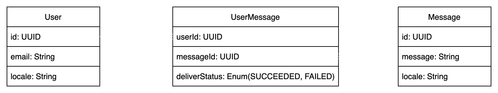
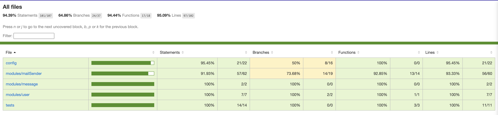

# Cope Notes Interview Task

## Running Local Environment
I have dockerized the application, so it can be run easily and consistently on any computer

### Prerequisites:
- Have Node 16 or higher installed
- Docker is installed

To get the local environment up and running, execute the follow steps

NOTE that these commands assume the use of a Linux based OS such as MacOS or Ubuntu. Use the respective windows commands if you're running this on Windows
1. Clone the repository by running `git clone https://github.com/TeyimPila/copenotes.git`
2. Navigate into the project's api folder: `cd copenotes/api`
3. Run `touch .env.development && cp .env.example` to create the development environment .env file
4. Open the newly created `.env.development` file in your favorite editor and replace `SG.example`and `d-example` with the correct sendgrid API key and template IDs respectively. The values for `SENDGRID_API_KEY` and `MESSAGE_TEMPLATE_ID` will be sent to Molly as part of my submission, since these are sensitive credentials and can't be share on github
6. While still in the `copenotes/api` directory, seed the development database with sample messages by running `yarn seed`
7. Now, everything is ready to start the servers
8. Navigate out of the `api` directory back into the root of the repo: `cd ..`
9. Run: `yarn run:dev` and wait for the docker containers to build and start
10. Access the frontend application through `http://localhost:3000`
11. Create a user and wait for the emails to come in 🙂
12. The API runs at: `http://localhost:8001`
13. The API documentations can be seen at `http://localhost:8001/read-the-docs`

## The API
The API is a simple well-structured express server, running NodeJS. See the folder structure below
### Implementation Consideration
I made the following considerations and compromises while implementing the API
- For simplicity, I used a lightweight file database called `db-local`. It writes data to json and supports a very limited set of queries. Mainly simple find. So the queries might not be the most performant as I had to query then filter in-memory most of the time
- I used TypeScript to have some typing and improved the overall robustness of the codebase
- I used swagger to document the API and the docs can be found at `http://localhost:8001/read-the-docs`
- To keep track of what message has been sent to which user, I introduced a `UserMessage` table that holds the userId, messageId and the delivery status of that message to the user. See #ERD section
- To keep things simple, I did not add timestamps to my database models but timestamps are very important in a production-grade system, especially for what that is time-sensitive such as CopeNotes
- I wrote some tests mainly to cover the core of the app. I.e the message scheduling and sending
- I used a simple javascript `setInterval` function as a cron job. In a more sophisticated app, I would implement a proper cron job
- I Integrated with sendgrid to send the emails to users. My sendgrid API key will be sent as part of this submission
- Added some validations for requests and return appropriate HTTP responses

### ERD


### API Documentation
The API exposes 4 simple endpoints that are documented at: http://localhost:8001/read-the-docs

The endpoints are:

- `GET: /api/v1/messages`: Gets all messages in the database
- `POST: /api/v1/messages`: Creates a new message
- `GET: /api/v1/users`: Gets all users in the database
- `POST: /api/v1/users`: Creates a new user

### Test Coverage


### What can be improved?
- More testing
- Cron job
- Proper DBMS
- More typing
- Better error handling and defensive programming

## The Client
The client is a NextJS application in the `copenotes/client` folder. It uses material UI as the UI library. It has a simple interface for creating messages and users

### Implementation Consideration
- Keep it as simple as possible
- Take advantage of NextJS server side rendering for better performance

### What can be improved?
- Better decomposition of components for reuse
- Better error handling
- Some code refactoring
- Write Tests

## Possible overall improvements
- Considering the fact that mental health crises is global, I would add the ability for users to choose a language when registering, and translate messages to all supported languages so that users can receive messages in their own language. 🇬🇧🇵🇹🇩🇪🇫🇷🇺🇸🇳🇬
- Make it possible to configure the timer so that it can be changes, paused and/or restarted from the dashboard. This is quite easy to do
- Add authentication and authorization to make sure that only authorized users can use the app
- Add ability for update user and message details from the dashboard
- Deploy to a live environment: I would have loved to host this but Heroku took away our free tier 🥲. Alternatives are not as good but this will be a nice challenge
- Make the API more performant by setting up and full DBMS and using better queries

## Folder Structure
```text
.
|-- README.md
|-- api
|   |-- Dockerfile
|   |-- Dockerfile.local
|   |-- README.md
|   |-- databases
|   |   |-- Message.json
|   |   |-- User.json
|   |   `-- UserMessage.json
|   |-- docker-compose.local.yml
|   |-- docker-compose.yml
|   |-- docs
|   |   |-- erd.png
|   |   |-- swagger.json
|   |   `-- testCoverage.png
|   |-- jest.config.ts
|   |-- package.json
|   |-- src
|   |   |-- config
|   |   |   |-- database.ts
|   |   |   |-- env.ts
|   |   |   |-- logger.ts
|   |   |   `-- sendgrid.ts
|   |   |-- index.ts
|   |   |-- middleware
|   |   |   |-- authMiddleware.ts
|   |   |   |-- index.ts
|   |   |   |-- userContext.ts
|   |   |   `-- validators
|   |   |       |-- messageValidators.ts
|   |   |       `-- userValidators.ts
|   |   |-- modules
|   |   |   |-- index.ts
|   |   |   |-- mailSender
|   |   |   |   `-- mailingService.ts
|   |   |   |-- message
|   |   |   |   |-- messageController.ts
|   |   |   |   |-- messageModel.ts
|   |   |   |   |-- routes.ts
|   |   |   |   `-- types.ts
|   |   |   `-- user
|   |   |       |-- routes.ts
|   |   |       |-- types.ts
|   |   |       |-- userController.ts
|   |   |       |-- userMessageModel.ts
|   |   |       `-- userModel.ts
|   |   |-- seed
|   |   |   |-- sampleMessages.json
|   |   |   `-- seedDb.ts
|   |   |-- server.ts
|   |   |-- shared
|   |   |   `-- types.ts
|   |   `-- tests
|   |       |-- helpers.ts
|   |       `-- mailingService.test.ts
|   |-- tsconfig.json
|   |-- vercel.json
|   `-- yarn.lock
|-- client
|   |-- Dockerfile.local
|   |-- README.md
|   |-- components
|   |   |-- clickableCard.js
|   |   |-- layout.js
|   |   |-- newMessageDialog.js
|   |   `-- newUserDialog.js
|   |-- config
|   |   |-- axios.js
|   |   |-- createEmotionCache.js
|   |   `-- theme.js
|   |-- next.config.js
|   |-- package.json
|   |-- pages
|   |   |-- _app.js
|   |   |-- _document.js
|   |   |-- api
|   |   |   `-- hello.js
|   |   |-- config
|   |   |   `-- index.jsx
|   |   |-- index.jsx
|   |   |-- messages
|   |   |   `-- index.jsx
|   |   `-- users
|   |       `-- index.jsx
|   |-- public
|   |   |-- favicon.ico
|   |   `-- vercel.svg
|   |-- styles
|   |   |-- Home.module.css
|   |   `-- globals.css
|   `-- yarn.lock
|-- docker-compose.local.yml
`-- package.json

```